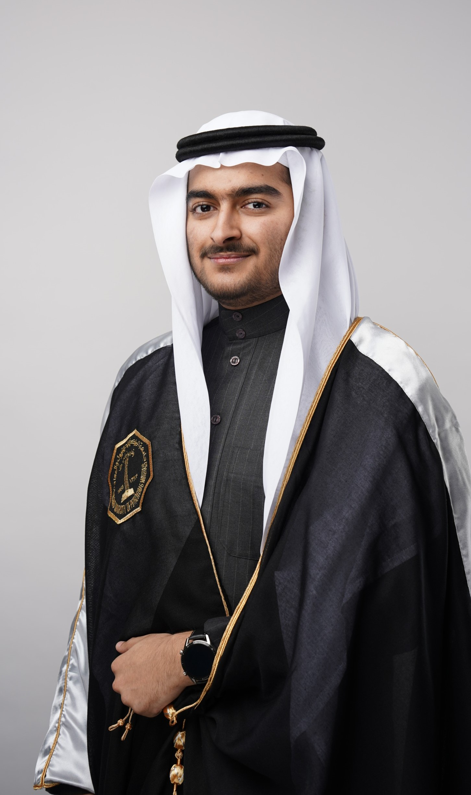
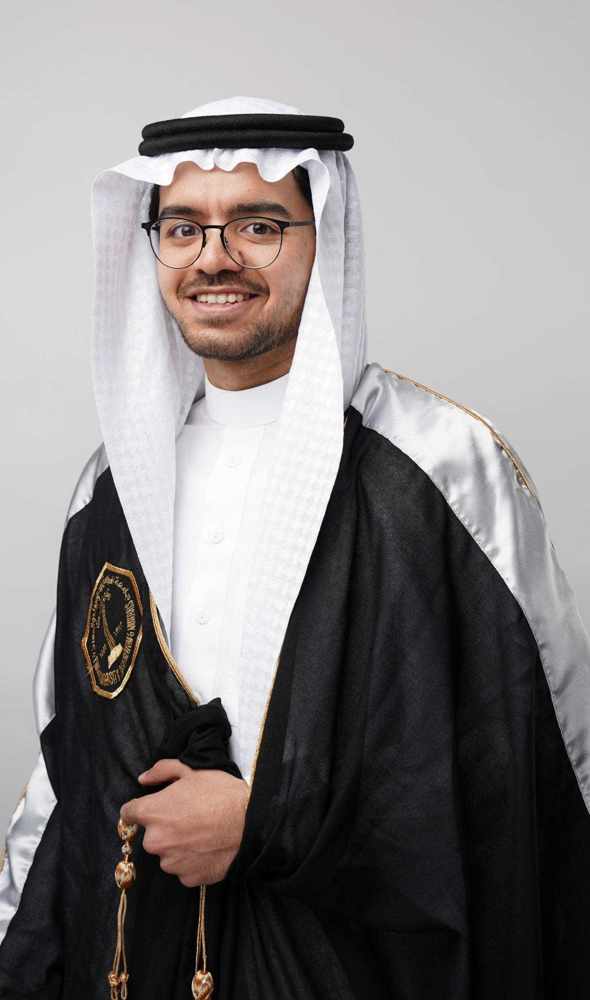
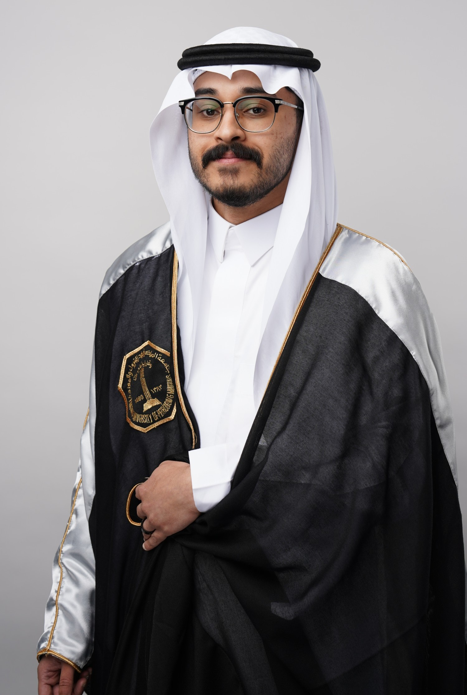
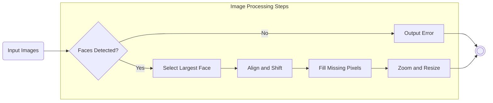
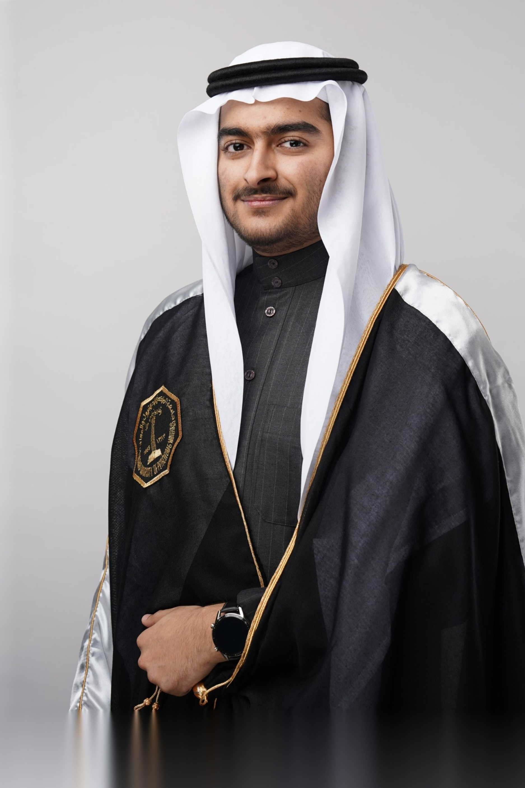
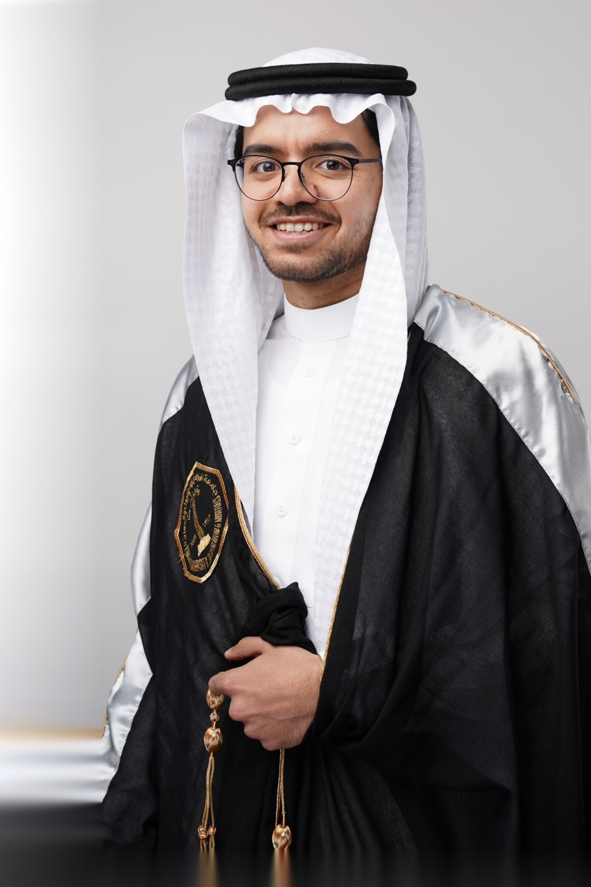
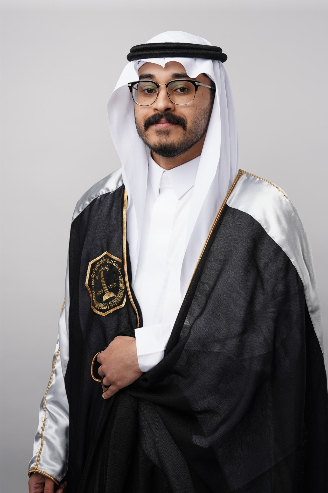

# Face Alignment and Adjustment Algorithm

This algorithm takes in images of people and outputs them aligned and centered so that the face is top-centered with a small gap on top. The algorithm uses cv2 face cascade classifier to detect faces in the input image. It then selects the largest face and aligns the image. Finally, it fills in missing pixels using cv2 inpaint and zooms in and resizes the output to a fixed size. The algorithm is written in Python and uses OpenCV and NumPy.

# Functions

1. `select_largest_face` function selects the largest face in the input image using the cv2 face cascade classifier.

2. `align` function aligns the input image by shifting it so that the eyes are level and centered in the image.

3. `zoom` function zooms in and resizes the aligned image to a fixed size.

# Algorithm Steps
## Input Images
<div style="display: flex; align-items: center; justify-content: center; gap: 1rem">
  
  
  
</div>

## Process


## Output Images
<div style="display: flex; align-items: center; justify-content: center; gap: 1rem">
  
  
  
</div>

# Installation

To use this algorithm, you must have the following packages installed:


* OpenCV (cv2)
* NumPy

You can install these packages using pip:

```sh
pip install opencv-python numpy
```

After installing the required packages, you can test it via `imageFixer.py`.

# Limitations

This algorithm has some limitations:

- It may not work well for images with multiple faces.
- It may not work well for images with faces that are not fully visible or are obstructed.
- It may not work well for images with low resolution or poor lighting conditions.
